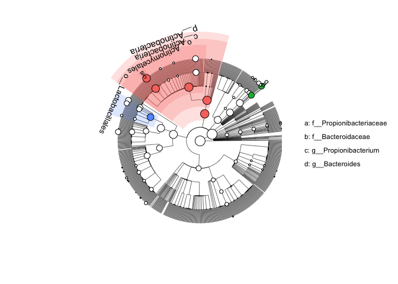

<!-- README.md is generated from README.Rmd. Please edit that file -->

<!-- badges: start -->

[](https://github.com/yiluheihei/microbiomeMarker/actions)
[](https://github.com/yiluheihei/microbiomeMarker/blob/master/LICENSE.md)
[](https://codecov.io/gh/yiluheihei/microbiomeMarker?branch=master)
[](https://zenodo.org/badge/latestdoi/215731961)
<!-- badges: end -->

## Motivation

**The aim of this package is to build a unified toolbox in R for
mcirobiome biomarker discovery by integrating various existing
methods.**

Many statistical methods have been proposed to discovery the microbiome
biomaker by compare the taxon abundance between different classes. Some
methods developed specifically for microbial community, such as linear
discriminant analysis (LDA) effect size (LEfSe) (Segata et al. 2011),
metagenomeSeq (Paulson et al. 2013); and some methods developed
specifically for RNA-Seq data, such as DESeq2 (Love, Huber, and Anders
2014) and edgeR (Robinson, McCarthy, and Smyth 2009), have been proposed
for microbiome biomarker discovery. We usually use several methods for
microbiome biomarker discovery and compare the results, which requires
multiple tools developed in different programming, even in different OS.

**microbiomeMarker** take the `phyloseq-class` object in package
[phyloseq](https://github.com/joey711/phyloseq) as input, since
**phyloseq** is the most popular R package in microbiome analysis and
with phyloseq you can easily import taxon abundance and phylogenetic
tree of taxon output from common microbiome bioinformatics platforms,
such as [DADA2](https://benjjneb.github.io/dada2/) and
[qiime2](https://qiime2.org/).

## Installation

You can install the package directly from github

``` r
if (!require(remotes)) install.packages("remotes")
remotes::install_github("yiluheihei/microbiomeMarker")
```

## LEfSe

Curently, LEfSe is the most used tool for microbiome biomarker
discovery, and the first method to integrate to **microbiomeMarker** is
LEfSe.

### lefse analysis

``` r
library(microbiomeMarker)
#> Registered S3 method overwritten by 'treeio':
#>   method     from
#>   root.phylo ape
library(ggplot2)

# sample data from lefse python script. The dataset contains 30 abundance 
# profiles (obtained processing the 16S reads with RDP) belonging to 10 rag2 
# (control) and 20 truc (case) mice
data("spontaneous_colitis")
lefse_out <- lefse(
  spontaneous_colitis, 
  normalization = 1e6, 
  class = "class", 
  multicls_strat = TRUE
)
# lefse return a microbioMarker class inherits from phyloseq
lefse_out
#> microbiomeMarker-class inherited from phyloseq-class
#> marker_table  Marker Table:      [ 29 microbiome markers with 5 variables ]
#> otu_table()   OTU Table:         [ 132 taxa and  30 samples ]
#> tax_table()   Taxonomy Table:    [ 132 taxa by 1 taxonomic ranks ]
```

The microbiome biomarker information was stored in a new data structure
`marker_table-class` inherited from `data.frame`, and you can access it
by using `marker_table()`.

``` r
head(marker_table(lefse_out))
#>                                                                                       feature
#> 1                                                                      Bacteria|Bacteroidetes
#> 2                                                          Bacteria|Bacteroidetes|Bacteroidia
#> 3                                            Bacteria|Bacteroidetes|Bacteroidia|Bacteroidales
#> 4 Bacteria|Actinobacteria|Actinobacteria|Bifidobacteriales|Bifidobacteriaceae|Bifidobacterium
#> 5                         Bacteria|Bacteroidetes|Bacteroidia|Bacteroidales|Porphyromonadaceae
#> 6                 Bacteria|Actinobacteria|Actinobacteria|Bifidobacteriales|Bifidobacteriaceae
#>   enrich_group log_max_mean      lda      p_value
#> 1         rag2     5.451241 5.178600 0.0155342816
#> 2         rag2     5.433686 5.178501 0.0137522075
#> 3         rag2     5.433686 5.178501 0.0137522075
#> 4         rag2     5.082944 5.044767 0.0001217981
#> 5         rag2     4.987349 4.886991 0.0013201097
#> 6         rag2     4.789752 4.750839 0.0001217981
```

### Visualization of the result of lefse analysis

Bar plot for output of lefse:

``` r
lefse_barplot(lefse_out, label_level = 1) +
  scale_fill_manual(values = c("rag2" = "blue", "truc" = "red"))
```

<!-- -->

Cladogram plot for output of lefse

``` r
lefse_cladogram(lefse_out, color = c("blue", "red"))
```

<!-- -->

## statistical analysis (stamp)

STAMP (Parks et al. 2014) is a widely-used graphical software package
that provides “best pratices” in choose appropriate statistical methods
for microbial taxonomic and functional analysis. Users can tests for
both two groups or multiple groups, and effect sizes and confidence
intervals are supported that allows critical assessment of the
biological relevancy of test results. Here, **microbiomeMarker** also
integrates the statistical methods used in STAMP for microbial
comparison analysis between two-groups and multiple-groups.

### Statitical analysis between two groups

Function `test_two_groups()` is developed for statistical test between
two groups, and three test methods are provided: welch test, t test and
white test.

``` r
data("enterotypes_arumugam")
# take welch test for example
two_group_welch <- test_two_groups(
  enterotypes_arumugam, 
  group = "Gender", 
  rank_name = "Genus", 
  method = "welch.test"
)

# three significantly differential genera (marker)
two_group_welch
#> microbiomeMarker-class inherited from phyloseq-class
#> marker_table  Marker Table:      [ 3 microbiome markers with 9 variables ]
#> otu_table()   OTU Table:         [ 248 taxa and  39 samples ]
#> tax_table()   Taxonomy Table:    [ 248 taxa by 2 taxonomic ranks ]
# details of result of the three markers
head(marker_table(two_group_welch))
#>              feature     pvalue F_mean_rel_freq M_mean_rel_freq     diff_mean
#> 1         Parvimonas 0.03281399    0.0003822353     0.001722092 -0.0013398567
#> 2 Peptostreptococcus 0.01714937    0.0039598236     0.010654869 -0.0066950454
#> 3     Heliobacterium 0.02940341    0.0002076471     0.001061864 -0.0008542172
#>       ci_lower      ci_upper ratio_proportion pvalue_corrected
#> 1 -0.002560839 -1.188741e-04        0.2219599       0.03281399
#> 2 -0.012106408 -1.283683e-03        0.3716445       0.01714937
#> 3 -0.001616006 -9.242875e-05        0.1955495       0.02940341
```

### Statistical analysis multiple groups

Function `test_multiple_groups()` is constructed for statistical test
for multiple groups, two test method are provided: anova and kruskal
test.

``` r
# three groups
ps <- phyloseq::subset_samples(
  enterotypes_arumugam,
  Enterotype %in% c("Enterotype 3", "Enterotype 2", "Enterotype 1")
)

multiple_group_anova <-  test_multiple_groups(
  ps, 
  group = "Enterotype", 
  rank_name = "Genus",
  method = "anova"
)

# 22 markers (significantly differential genera)
multiple_group_anova
#> microbiomeMarker-class inherited from phyloseq-class
#> marker_table  Marker Table:      [ 22 microbiome markers with 7 variables ]
#> otu_table()   OTU Table:         [ 248 taxa and  32 samples ]
#> tax_table()   Taxonomy Table:    [ 248 taxa by 2 taxonomic ranks ]
head(marker_table(multiple_group_anova))
#>          feature       pvalue pvalue_corrected effect_size
#> 1    Bacteroides 8.396825e-10     8.396825e-10   0.7633661
#> 2     Bartonella 7.531192e-03     7.531192e-03   0.2861996
#> 3       Brucella 3.063042e-02     3.063042e-02   0.2136846
#> 4  Granulibacter 1.354378e-02     1.354378e-02   0.2567165
#> 5    Macrococcus 1.522491e-02     1.522491e-02   0.2506944
#> 6 Rhodospirillum 1.198159e-03     1.198159e-03   0.3711917
#>   Enterotype 1:mean_rel_freq_percent Enterotype 2:mean_rel_freq_percent
#> 1                           34.95871                       6.8192256518
#> 2                            0.00000                       0.0012021667
#> 3                            0.00000                       0.0007033333
#> 4                            0.00000                       0.0008008333
#> 5                            0.00000                       0.0006470000
#> 6                            0.00000                       0.0010731667
#>   Enterotype 3:mean_rel_freq_percent
#> 1                       8.913236e+00
#> 2                       0.000000e+00
#> 3                       0.000000e+00
#> 4                       0.000000e+00
#> 5                       2.072222e-05
#> 6                       7.238889e-05
```

The result of multiple group statistic specified whether the means of
all groups is equal or not. To identify which pairs of groups may differ
from each other, post-hoc test must be performed.

``` r
pht <- posthoc_test(ps, group = "Enterotype" , rank_name = "Genus")
pht
#> postHocTest-class object
#> Pairwise test result of 248  features,  DataFrameList object, each DataFrame has five variables:
#>         comparions    : pair groups to test which separated by '-'
#>         diff_mean_prop: difference in mean proportions
#>         pvalue        : post hoc test p values
#>         ci_lower_prop : lower confidence interval
#>         ci_upper_prop : upper confidence interval
#> Posthoc multiple comparisons of means  using  tukey  method

# 22 significantly differential genera
markers <- marker_table(multiple_group_anova)$feature
markers
#>                  sp1                 sp12                 sp15 
#>        "Bacteroides"         "Bartonella"           "Brucella" 
#>                 sp22                 sp25                 sp27 
#>      "Granulibacter"        "Macrococcus"     "Rhodospirillum" 
#>                 sp93                sp113                sp124 
#>      "Lactobacillus"      "Streptococcus"   "Stenotrophomonas" 
#>                sp149                sp153                sp157 
#>        "Selenomonas"    "Subdoligranulum"       "Ruminococcus" 
#>                sp174                sp180                sp196 
#> "Peptostreptococcus"          "Catonella"          "Bulleidia" 
#>                sp197                sp200                sp203 
#>    "Catenibacterium"         "Holdemania"    "Parabacteroides" 
#>                sp205                sp206                sp241 
#>         "Prevotella"          "Alistipes"          "Scardovia" 
#>                sp248 
#>       "Unclassified"
# take a marker Bacteroides for example, we will show Bacteroides differ from 
# between Enterotype 2-Enterotype 1 and Enterotype 3-Enterotype 2.
pht@result$Bacteroides
#> DataFrame with 3 rows and 5 columns
#>                  comparions diff_mean_prop      pvalue ci_lower_prop
#>                 <character>      <numeric>   <numeric>     <numeric>
#> 1 Enterotype 2-Enterotype 1      -28.13948 4.77015e-08     -37.13469
#> 2 Enterotype 3-Enterotype 1      -26.04547 1.63635e-09     -33.12286
#> 3 Enterotype 3-Enterotype 2        2.09401 7.88993e-01      -5.75765
#>   ci_upper_prop
#>       <numeric>
#> 1     -19.14428
#> 2     -18.96808
#> 3       9.94567
```

Visualization of post test result of a given feature.

``` r
# visualize the post hoc test result of Bacteroides
plot_postHocTest(pht, feature = "Bacteroides")
```

<!-- -->

## Welcome

**microbiomeMarker is still a newborn, and only contains lefse methods
right now. Your suggestion and contribution will be highly
appreciated.**

## Citation

Kindly cite as follows: Yang Cao (2020). microbiomeMarker: microbiome
biomarker analysis. R package version 0.0.1.9000.
<https://github.com/yiluheihei/microbiomeMarker>. DOI:
[10.5281/zenodo.3749415](https://doi.org/10.5281/zenodo.3749415).

## Acknowledgement

  - [lefse python
    script](https://bitbucket.org/biobakery/biobakery/wiki/lefse), The
    main lefse code are translated from **lefse python script**,
  - [microbiomeViz](https://github.com/lch14forever/microbiomeViz),
    cladogram visualization of lefse is modified from **microbiomeViz**.
  - [phyloseq](https://github.com/joey711/phyloseq), the main data
    structures used in **microbiomeMarker** are from or inherit from
    `phyloseq-class` in package **phyloseq**.

## Question

If you have any question, please file an issue on the issue tracker
following the instructions in the issue template:

Please briefly describe your problem, what output actually happend, and
what output you expect.

Please provide a minimal reproducible example. For more deails on how to
make a great minimal reproducible example, see
<https://stackoverflow.com/questions/5963269/how-to-make-a-great-r-reproducible-example>
and <https://www.tidyverse.org/help/#reprex>.

    Brief description of the problem
    
    # insert minimal reprducible example here

## Reference

<div id="refs" class="references">

<div id="ref-Love_2014">

Love, Michael I, Wolfgang Huber, and Simon Anders. 2014. “Moderated
Estimation of Fold Change and Dispersion for RNA-Seq Data with DESeq2.”
*Genome Biology* 15 (12). <https://doi.org/10.1186/s13059-014-0550-8>.

</div>

<div id="ref-Parks_2014">

Parks, Donovan H., Gene W. Tyson, Philip Hugenholtz, and Robert G.
Beiko. 2014. “STAMP: Statistical Analysis of Taxonomic and Functional
Profiles.” *Bioinformatics* 30 (21): 3123–4.
<https://doi.org/10.1093/bioinformatics/btu494>.

</div>

<div id="ref-Paulson_2013">

Paulson, Joseph N, O Colin Stine, H’ector Corrada Bravo, and Mihai Pop.
2013. “Differential Abundance Analysis for Microbial Marker-Gene
Surveys.” *Nature Methods* 10 (12): 1200–1202.
<https://doi.org/10.1038/nmeth.2658>.

</div>

<div id="ref-Robinson_2009">

Robinson, M. D., D. J. McCarthy, and G. K. Smyth. 2009. “edgeR: A
Bioconductor Package for Differential Expression Analysis of Digital
Gene Expression Data.” *Bioinformatics* 26 (1): 139–40.
<https://doi.org/10.1093/bioinformatics/btp616>.

</div>

<div id="ref-Segata_2011">

Segata, Nicola, Jacques Izard, Levi Waldron, Dirk Gevers, Larisa
Miropolsky, Wendy S Garrett, and Curtis Huttenhower. 2011. “Metagenomic
Biomarker Discovery and Explanation.” *Genome Biology* 12 (6): R60.
<https://doi.org/10.1186/gb-2011-12-6-r60>.

</div>

</div>
