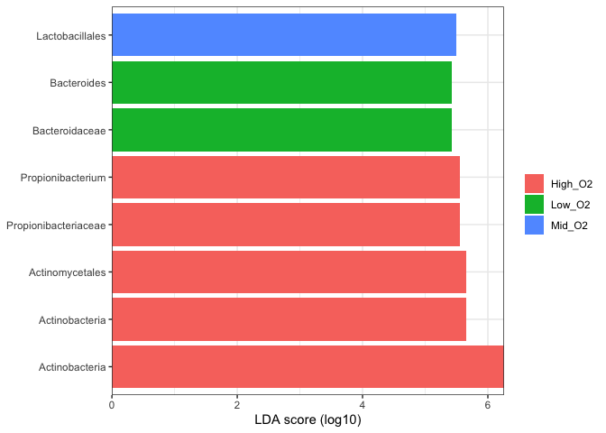
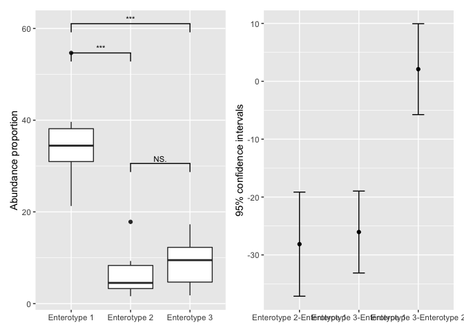
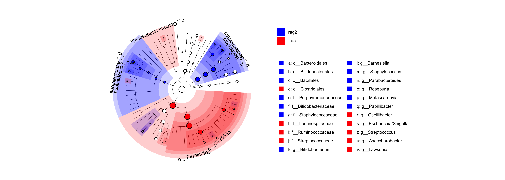
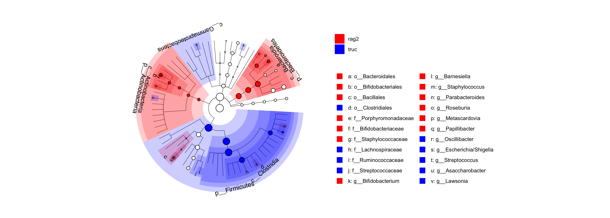

<!-- README.md is generated from README.Rmd. Please edit that file -->
<!-- badges: start -->

[](https://github.com/yiluheihei/microbiomeMarker/actions)
[](https://github.com/yiluheihei/microbiomeMarker/blob/master/LICENSE.md)
[](https://codecov.io/gh/yiluheihei/microbiomeMarker?branch=master)
[](https://zenodo.org/badge/latestdoi/215731961)
<!-- badges: end -->

**If you think this project is helpful to you, you can give this project
a star** :star:

## Motivation

**The aim of this package is to build a unified toolbox in R for
mcirobiome biomarker discovery by integrating various existing
methods.**

Many statistical methods have been proposed to discovery the microbiome
biomaker by compare the taxon abundance between different classes. Some
methods developed specifically for microbial community, such as linear
discriminant analysis (LDA) effect size (LEfSe) (Segata et al. 2011),
metagenomeSeq (Paulson et al. 2013); and some methods developed
specifically for RNA-Seq data, such as DESeq2 (Love, Huber, and Anders
2014) and edgeR \[@{Robinson\_2009\], have been proposed for microbiome
biomarker discovery. We usually use several methods for microbiome
biomarker discovery and compare the results, which requires multiple
tools developed in different programming, even in different OS.

**microbiomeMarker** take the `phyloseq-class` object in package
[phyloseq](https://github.com/joey711/phyloseq) as input, since
**phyloseq** is the most popular R package in microbiome analysis and
with phyloseq you can easily import taxon abundance and phylogenetic
tree of taxon output from common microbiome bioinformatics platforms,
such as [DADA2](https://benjjneb.github.io/dada2/) and
[qiime2](https://qiime2.org/).

## Citation

Kindly cite as follows: Yang Cao (2020). microbiomeMarker: microbiome
biomarker analysis. R package version 0.0.1.9000.
<https://github.com/yiluheihei/microbiomeMarker>. DOI:
[10.5281/zenodo.3749415](https://doi.org/10.5281/zenodo.3749415).

### Publications citing microbiomeMarker

-   Shanmugam, Gnanendra, Song Hee Lee, and Junhyun Jeon. “EzMAP: Easy
    Microbiome Analysis Platform.” BMC bioinformatics 22.1 (2021): 1-10.
-   Altaib, Hend, et al. “Differences in the Concentration of the Fecal
    Neurotransmitters GABA and Glutamate Are Associated with Microbial
    Composition among Healthy Human Subjects.” Microorganisms 9.2
    (2021): 378.
-   Ingham, Anna Cäcilia, et al. “Microbiota long-term dynamics and
    prediction of acute graft-versus-host-disease in pediatric
    allogeneic stem cell transplantation.” medRxiv (2021).

## Installation

You can install the package directly from github

``` r
if (!require(remotes)) install.packages("remotes")
remotes::install_github("yiluheihei/microbiomeMarker")
```

## Data import

Since [phyloseq](https://github.com/joey711/phyloseq) objects are a
great data-standard for microbiome data in R, the core functions in
**microbiomeMarker** take `phylosq` object as input. Conveniently,
**microbiomeMarker** provides features to import external data files
form two common tools of microbiome analysis,
[qiime2](http://qiime.org/) and
[dada2](https://benjjneb.github.io/dada2).

### Import from dada2

The output of the [dada2](https://benjjneb.github.io/dada2) pipeline is
a feature table of amplicon sequence variants (an ASV table): A matrix
with rows corresponding to samples and columns to ASVs, in which the
value of each entry is the number of times that ASV was observed in that
sample. This table is analogous to the traditional OTU table.
Conveniently, taxa names are saved as

``` r
library(microbiomeMarker)
#> Registered S3 method overwritten by 'treeio':
#>   method     from
#>   root.phylo ape

seq_tab <- readRDS(system.file("extdata", "dada2_seqtab.rds",
  package= "microbiomeMarker"))
tax_tab <- readRDS(system.file("extdata", "dada2_taxtab.rds",
 package= "microbiomeMarker"))
sam_tab <- read.table(system.file("extdata", "dada2_samdata.txt",
 package= "microbiomeMarker"), sep = "\t", header = TRUE, row.names = 1)
ps <- import_dada2(seq_tab = seq_tab, tax_tab = tax_tab, sam_tab = sam_tab)
ps
#> phyloseq-class experiment-level object
#> otu_table()   OTU Table:         [ 232 taxa and 20 samples ]
#> sample_data() Sample Data:       [ 20 samples by 4 sample variables ]
#> tax_table()   Taxonomy Table:    [ 232 taxa by 6 taxonomic ranks ]
#> refseq()      DNAStringSet:      [ 232 reference sequences ]
```

### Import from qiime2

[qiime2](http://qiime.org/) is the most widely used software for
metagenomic analysis. User can import the feature table, taxonomic
table, phylogenetic tree, representative sequence and sample metadata
from qiime2 using `import_qiime2()`.

``` r
otuqza_file <- system.file("extdata", "table.qza",package = "microbiomeMarker")
taxaqza_file <- system.file("extdata", "taxonomy.qza",package = "microbiomeMarker")
sample_file <- system.file(
  "extdata", "sample-metadata.tsv",
  package = "microbiomeMarker"
)
treeqza_file <- system.file("extdata", "tree.qza",package = "microbiomeMarker")
ps <- import_qiime2(
  otu_qza = otuqza_file, taxa_qza = taxaqza_file,
  sam_tab = sample_file, tree_qza = treeqza_file
)
#> Found more than one class "phylo" in cache; using the first, from namespace 'phyloseq'
#> Also defined by 'tidytree'
#> Found more than one class "phylo" in cache; using the first, from namespace 'phyloseq'
#> Also defined by 'tidytree'
#> Found more than one class "phylo" in cache; using the first, from namespace 'phyloseq'
#> Also defined by 'tidytree'
#> Found more than one class "phylo" in cache; using the first, from namespace 'phyloseq'
#> Also defined by 'tidytree'
#> Found more than one class "phylo" in cache; using the first, from namespace 'phyloseq'
#> Also defined by 'tidytree'
#> Found more than one class "phylo" in cache; using the first, from namespace 'phyloseq'
#> Also defined by 'tidytree'
#> Found more than one class "phylo" in cache; using the first, from namespace 'phyloseq'
#> Also defined by 'tidytree'
ps
#> phyloseq-class experiment-level object
#> otu_table()   OTU Table:         [ 770 taxa and 34 samples ]
#> sample_data() Sample Data:       [ 34 samples by 9 sample variables ]
#> tax_table()   Taxonomy Table:    [ 770 taxa by 7 taxonomic ranks ]
#> phy_tree()    Phylogenetic Tree: [ 770 tips and 768 internal nodes ]
```

### Import from tab-delimited input file of biobakery lefse

For [biobakey lefse](https://huttenhower.sph.harvard.edu/lefse/) (a
[Galaxy module](http://huttenhower.sph.harvard.edu/galaxy), a Conda
formula, a Docker image, and included in bioBakery (VM and cloud).), the
input file must be a tab-delimited text, consists of a list of numerical
features, the class vector and optionally the subclass and subject
vectors. The features can be read counts directly or abundance
floating-point values more generally, and the first field is the name of
the feature. Class, subclass and subject vectors have a name (the first
field) and a list of non-numerical strings. [biobakery
lefse](https://huttenhower.sph.harvard.edu/lefse/). User can import the
input file suitable for [biobakery
lefse](https://huttenhower.sph.harvard.edu/lefse/) to `phyloseq` object
using `import_biobakery_lefse_in()`

``` r
file <- system.file(
  "extdata",
  "hmp_small_aerobiosis.txt",
  package = "microbiomeMarker"
)
# six level of taxonomic ranks,
# meta data: row 1 represents class (oxygen_availability),
# row 2 represents subclass (body_site), row 3 represents subject (subject_id)
hmp_oxygen <- import_biobakery_lefse_in(
  file,
  ranks_prefix = c("k", "p", "c", "o", "f", "g"),
  meta_rows = 1:3,
)
hmp_oxygen
#> phyloseq-class experiment-level object
#> otu_table()   OTU Table:         [ 928 taxa and 55 samples ]
#> sample_data() Sample Data:       [ 55 samples by 3 sample variables ]
#> tax_table()   Taxonomy Table:    [ 928 taxa by 1 taxonomic ranks ]
```

### Other import functions reexport from phyloseq

**microbiomeMarker** reexports three import functions from **phyloseq**,
including `import_biom()`, `import_qiime()` and `import_mothur()`, to
help users to import data from [biom file](http://biom-format.org/), and
output from [qiime](http://www.qiime.org/) and
[mothur](http://www.mothur.org/). More details on these three import
functions can be see from
[here](https://joey711.github.io/phyloseq/import-data.html#the_import_family_of_functions).

Users can also import the external files into `phyloseq` object
manually. For more details on how to create `phyloseq` object from
manually imported data, please see [this
tutorial](http://joey711.github.io/phyloseq/import-data.html#manual).

## LEfSe

Curently, LEfSe is the most used tool for microbiome biomarker
discovery, and the first method to integrate to **microbiomeMarker** is
LEfSe.

### lefse analysis

``` r
library(ggplot2)

# sample data from lefse python script. The dataset contains 30 abundance 
# profiles (obtained processing the 16S reads with RDP) belonging to 10 rag2 
# (control) and 20 truc (case) mice
data("spontaneous_colitis")
# add prefix of ranks
mm <- lefse(
  spontaneous_colitis, 
  norm = "CPM", 
  class = "class", 
  multicls_strat = TRUE
)
# lefse return a microbioMarker class inherits from phyloseq
mm
#> microbiomeMarker-class inherited from phyloseq-class
#> normalization method:              [ CPM ]
#> microbiome marker identity method: [ lefse ]
#> marker_table() Marker Table:       [ 29 microbiome markers with 5 variables ]
#> otu_table()    OTU Table:          [ 132 taxa and  30 samples ]
#> sample_data()  Sample Data:        [ 30 samples by  1 sample variables ]
#> tax_table()    Taxonomy Table:     [ 132 taxa by 1 taxonomic ranks ]
```

The microbiome biomarker information was stored in a new data structure
`marker_table-class` inherited from `data.frame`, and you can access it
by using `marker_table()`.

``` r
head(marker_table(mm))
#>                                                                                                               feature
#> marker1                                                                                  k__Bacteria|p__Bacteroidetes
#> marker2                                                                   k__Bacteria|p__Bacteroidetes|c__Bacteroidia
#> marker3                                                  k__Bacteria|p__Bacteroidetes|c__Bacteroidia|o__Bacteroidales
#> marker4 k__Bacteria|p__Actinobacteria|c__Actinobacteria|o__Bifidobacteriales|f__Bifidobacteriaceae|g__Bifidobacterium
#> marker5                            k__Bacteria|p__Bacteroidetes|c__Bacteroidia|o__Bacteroidales|f__Porphyromonadaceae
#> marker6                    k__Bacteria|p__Actinobacteria|c__Actinobacteria|o__Bifidobacteriales|f__Bifidobacteriaceae
#>         enrich_group      lda       pvalue         padj
#> marker1         rag2 5.178600 0.0155342816 0.0155342816
#> marker2         rag2 5.178501 0.0137522075 0.0137522075
#> marker3         rag2 5.178501 0.0137522075 0.0137522075
#> marker4         rag2 5.044767 0.0001217981 0.0001217981
#> marker5         rag2 4.886991 0.0013201097 0.0013201097
#> marker6         rag2 4.750839 0.0001217981 0.0001217981
```

### Visualization of the result of lefse analysis

Bar plot for output of lefse:

``` r
plot_ef_bar(mm, label_level = 1) +
  scale_fill_manual(values = c("rag2" = "blue", "truc" = "red"))
```

<!-- -->

## statistical analysis (stamp)

STAMP (Parks et al. 2014) is a widely-used graphical software package
that provides “best pratices” in choose appropriate statisticalmethods
for microbial taxonomic and functional analysis. Users can tests for
both two groups or multiple groups, and effect sizes and confidence
intervals are supported that allows critical assessment of the
biological relevancy of test results. Here, **microbiomeMarker** also
integrates the statistical methods used in STAMP for microbial
comparison analysis between two-groups and multiple-groups.

### Statitical analysis between two groups

Function `test_two_groups()` is developed for statistical test between
two groups, and three test methods are provided: welch test, t test and
white test.

``` r
data("enterotypes_arumugam")
# take welch test for example
two_group_welch <- test_two_groups(
  enterotypes_arumugam, 
  group = "Gender", 
  method = "welch.test"
)

# three significantly differential genera (marker)
two_group_welch
#> microbiomeMarker-class inherited from phyloseq-class
#> normalization method:              [ TSS ]
#> microbiome marker identity method: [ welch.test ]
#> marker_table() Marker Table:       [ 3 microbiome markers with 5 variables ]
#> otu_table()    OTU Table:          [ 244 taxa and  39 samples ]
#> sample_data()  Sample Data:        [ 39 samples by  9 sample variables ]
#> tax_table()    Taxonomy Table:     [ 244 taxa by 1 taxonomic ranks ]
# details of result of the three markers
head(marker_table(two_group_welch))
#>                                     feature enrich_group     diff_mean
#> marker1     p__Firmicutes|g__Heliobacterium            M -4.271086e-06
#> marker2         p__Firmicutes|g__Parvimonas            M -6.699283e-06
#> marker3 p__Firmicutes|g__Peptostreptococcus            M -3.347523e-05
#>             pvalue       padj
#> marker1 0.02940341 0.02940341
#> marker2 0.03281399 0.03281399
#> marker3 0.01714937 0.01714937
```

### Statistical analysis multiple groups

Function `test_multiple_groups()` is constructed for statistical test
for multiple groups, two test method are provided: anova and kruskal
test.

``` r
# three groups
ps <- phyloseq::subset_samples(
  enterotypes_arumugam,
  Enterotype %in% c("Enterotype 3", "Enterotype 2", "Enterotype 1")
)

multiple_group_anova <-  test_multiple_groups(
  ps,
  group = "Enterotype", 
  method = "anova"
)

# 24 markers
multiple_group_anova
#> microbiomeMarker-class inherited from phyloseq-class
#> normalization method:              [ TSS ]
#> microbiome marker identity method: [ anova ]
#> marker_table() Marker Table:       [ 24 microbiome markers with 5 variables ]
#> otu_table()    OTU Table:          [ 238 taxa and  32 samples ]
#> sample_data()  Sample Data:        [ 32 samples by  9 sample variables ]
#> tax_table()    Taxonomy Table:     [ 238 taxa by 1 taxonomic ranks ]
head(marker_table(multiple_group_anova))
#>                                     feature enrich_group eta_squared
#> marker1                    p__Bacteroidetes Enterotype 1   0.5821619
#> marker2                     p__Unclassified Enterotype 3   0.4497271
#> marker3      p__Actinobacteria|g__Scardovia Enterotype 2   0.2196652
#> marker4       p__Bacteroidetes|g__Alistipes Enterotype 3   0.2001541
#> marker5     p__Bacteroidetes|g__Bacteroides Enterotype 1   0.7633661
#> marker6 p__Bacteroidetes|g__Parabacteroides Enterotype 1   0.2582573
#>               pvalue         padj
#> marker1 3.196070e-06 3.196070e-06
#> marker2 1.731342e-04 1.731342e-04
#> marker3 2.742042e-02 2.742042e-02
#> marker4 3.922758e-02 3.922758e-02
#> marker5 8.396825e-10 8.396825e-10
#> marker6 1.314233e-02 1.314233e-02
```

The result of multiple group statistic specified whether the means of
all groups is equal or not. To identify which pairs of groups may differ
from each other, post-hoc test must be performed.

``` r
pht <- posthoc_test(ps, group = "Enterotype")
pht
#> postHocTest-class object
#> Pairwise test result of 238  features,  DataFrameList object, each DataFrame has five variables:
#>         comparions    : pair groups to test which separated by '-'
#>         diff_mean: difference in mean proportions
#>         pvalue        : post hoc test p values
#>         ci_lower : lower confidence interval
#>         ci_upper : upper confidence interval
#> Posthoc multiple comparisons of means  using  tukey  method

# 24 significantly differential genera
markers <- marker_table(multiple_group_anova)$feature
markers
#>                        p__Bacteroidetes                         p__Unclassified 
#>                      "p__Bacteroidetes"                       "p__Unclassified" 
#>          p__Actinobacteria|g__Scardovia           p__Bacteroidetes|g__Alistipes 
#>        "p__Actinobacteria|g__Scardovia"         "p__Bacteroidetes|g__Alistipes" 
#>         p__Bacteroidetes|g__Bacteroides     p__Bacteroidetes|g__Parabacteroides 
#>       "p__Bacteroidetes|g__Bacteroides"   "p__Bacteroidetes|g__Parabacteroides" 
#>          p__Bacteroidetes|g__Prevotella              p__Firmicutes|g__Bulleidia 
#>        "p__Bacteroidetes|g__Prevotella"            "p__Firmicutes|g__Bulleidia" 
#>        p__Firmicutes|g__Catenibacterium              p__Firmicutes|g__Catonella 
#>      "p__Firmicutes|g__Catenibacterium"            "p__Firmicutes|g__Catonella" 
#>             p__Firmicutes|g__Holdemania          p__Firmicutes|g__Lactobacillus 
#>           "p__Firmicutes|g__Holdemania"        "p__Firmicutes|g__Lactobacillus" 
#>            p__Firmicutes|g__Macrococcus     p__Firmicutes|g__Peptostreptococcus 
#>          "p__Firmicutes|g__Macrococcus"   "p__Firmicutes|g__Peptostreptococcus" 
#>           p__Firmicutes|g__Ruminococcus            p__Firmicutes|g__Selenomonas 
#>         "p__Firmicutes|g__Ruminococcus"          "p__Firmicutes|g__Selenomonas" 
#>          p__Firmicutes|g__Streptococcus        p__Firmicutes|g__Subdoligranulum 
#>        "p__Firmicutes|g__Streptococcus"      "p__Firmicutes|g__Subdoligranulum" 
#>         p__Proteobacteria|g__Bartonella           p__Proteobacteria|g__Brucella 
#>       "p__Proteobacteria|g__Bartonella"         "p__Proteobacteria|g__Brucella" 
#>      p__Proteobacteria|g__Granulibacter     p__Proteobacteria|g__Rhodospirillum 
#>    "p__Proteobacteria|g__Granulibacter"   "p__Proteobacteria|g__Rhodospirillum" 
#>   p__Proteobacteria|g__Stenotrophomonas         p__Unclassified|g__Unclassified 
#> "p__Proteobacteria|g__Stenotrophomonas"       "p__Unclassified|g__Unclassified"
# take a marker "p__Bacteroidetes|g__Bacteroides"  
# for example, we will show "p__Bacteroidetes|g__Bacteroides"  differ from 
# between Enterotype 2-Enterotype 1 and Enterotype 3-Enterotype 2.
pht@result$"p__Bacteroidetes|g__Bacteroides"
#> DataFrame with 3 rows and 5 columns
#>                                       comparions  diff_mean      pvalue
#>                                      <character>  <numeric>   <numeric>
#> Enterotype 2-Enterotype 1 Enterotype 2-Enterot.. -0.2813948 4.77015e-08
#> Enterotype 3-Enterotype 1 Enterotype 3-Enterot.. -0.2604547 1.63635e-09
#> Enterotype 3-Enterotype 2 Enterotype 3-Enterot..  0.0209401 7.88993e-01
#>                             ci_lower   ci_upper
#>                            <numeric>  <numeric>
#> Enterotype 2-Enterotype 1 -0.3713469 -0.1914428
#> Enterotype 3-Enterotype 1 -0.3312286 -0.1896808
#> Enterotype 3-Enterotype 2 -0.0575765  0.0994567
```

Visualization of post test result of a given feature.

``` r
# visualize the post hoc test result of Bacteroides
plot_postHocTest(pht, feature = "p__Bacteroidetes|g__Bacteroides")
```

<!-- -->

## metagenomeSeq

``` r
mm_mgs <- run_metagenomeseq(
  pediatric_ibd,
  "Class",
  contrast = c("CD","Control"),
  pvalue_cutoff = 0.1,
  p_adjust = "fdr"
)
mm_mgs
#> microbiomeMarker-class inherited from phyloseq-class
#> normalization method:              [ CSS ]
#> microbiome marker identity method: [ metagenomeSeq: ZILN ]
#> marker_table() Marker Table:       [ 11 microbiome markers with 5 variables ]
#> otu_table()    OTU Table:          [ 786 taxa and  43 samples ]
#> sample_data()  Sample Data:        [ 43 samples by  2 sample variables ]
#> tax_table()    Taxonomy Table:     [ 786 taxa by 1 taxonomic ranks ]

# multiple groups comparison
ps <- phyloseq::subset_samples(
  cid_ying,
  Consistency %in% c("formed stool", "liquid", "semi-formed")
)
mm_mgs_multiple <- run_metagenomeseq(ps, "Consistency", method = "ZIG")
#> it= 0, nll=608.38, log10(eps+1)=Inf, stillActive=669
#> it= 1, nll=621.65, log10(eps+1)=0.02, stillActive=137
#> it= 2, nll=617.53, log10(eps+1)=0.04, stillActive=132
#> it= 3, nll=613.29, log10(eps+1)=0.04, stillActive=124
#> it= 4, nll=608.76, log10(eps+1)=0.07, stillActive=95
#> it= 5, nll=605.16, log10(eps+1)=0.07, stillActive=60
#> it= 6, nll=603.49, log10(eps+1)=0.07, stillActive=35
#> it= 7, nll=604.06, log10(eps+1)=0.05, stillActive=23
#> it= 8, nll=607.70, log10(eps+1)=0.00, stillActive=0
mm_mgs_multiple
#> microbiomeMarker-class inherited from phyloseq-class
#> normalization method:              [ CSS ]
#> microbiome marker identity method: [ metagenomeSeq: ZIG ]
#> marker_table() Marker Table:       [ 486 microbiome markers with 5 variables ]
#> otu_table()    OTU Table:          [ 669 taxa and  413 samples ]
#> sample_data()  Sample Data:        [ 413 samples by  6 sample variables ]
#> tax_table()    Taxonomy Table:     [ 669 taxa by 1 taxonomic ranks ]
```

## DESeq2

``` r
# two groups comparison
mm_des <- run_deseq2(
  pediatric_ibd, 
  "Class", 
  contrast = c("Control", "CD"), 
  pvalue_cutoff = 0.05, 
  p_adjust = "fdr"
)
mm_des
#> microbiomeMarker-class inherited from phyloseq-class
#> normalization method:              [ RLE ]
#> microbiome marker identity method: [ DESeq2: Wald ]
#> marker_table() Marker Table:       [ 47 microbiome markers with 5 variables ]
#> otu_table()    OTU Table:          [ 786 taxa and  43 samples ]
#> sample_data()  Sample Data:        [ 43 samples by  2 sample variables ]
#> tax_table()    Taxonomy Table:     [ 786 taxa by 1 taxonomic ranks ]

# multiple groups
mm_des_multiple <- run_deseq2(
  ps,
  "Consistency",
  pvalue_cutoff = 0.05,
  p_adjust = "fdr"
)
mm_des_multiple
#> microbiomeMarker-class inherited from phyloseq-class
#> normalization method:              [ RLE ]
#> microbiome marker identity method: [ DESeq2: LRT ]
#> marker_table() Marker Table:       [ 90 microbiome markers with 5 variables ]
#> otu_table()    OTU Table:          [ 669 taxa and  413 samples ]
#> sample_data()  Sample Data:        [ 413 samples by  6 sample variables ]
#> tax_table()    Taxonomy Table:     [ 669 taxa by 1 taxonomic ranks ]
```

## edgeR

``` r
mm_edger <- run_edger(
  pediatric_ibd,
  "Class",
  c("CD", "Control"),
  pvalue_cutoff = 0.1,
  p_adjust = "fdr"
)
mm_edger
#> microbiomeMarker-class inherited from phyloseq-class
#> normalization method:              [ TMM ]
#> microbiome marker identity method: [ edgeR: LRT ]
#> marker_table() Marker Table:       [ 34 microbiome markers with 5 variables ]
#> otu_table()    OTU Table:          [ 786 taxa and  43 samples ]
#> sample_data()  Sample Data:        [ 43 samples by  2 sample variables ]
#> tax_table()    Taxonomy Table:     [ 786 taxa by 1 taxonomic ranks ]

# multiple groups
mm_edger_multiple <- run_edger(
  ps,
  "Consistency",
  method  = "QLFT",
  pvalue_cutoff = 0.05,
  p_adjust = "fdr"
)
mm_edger_multiple
#> microbiomeMarker-class inherited from phyloseq-class
#> normalization method:              [ TMM ]
#> microbiome marker identity method: [ edgeR: QLFT ]
#> marker_table() Marker Table:       [ 325 microbiome markers with 5 variables ]
#> otu_table()    OTU Table:          [ 669 taxa and  413 samples ]
#> sample_data()  Sample Data:        [ 413 samples by  6 sample variables ]
#> tax_table()    Taxonomy Table:     [ 669 taxa by 1 taxonomic ranks ]
```

## ANCOM

``` r
mm_ancom <- run_ancom(ecam, "delivery", p_adjust = "none", theta = 0.6)
marker_table(mm_ancom)
#>                                                                                                                feature
#> marker1                                                                                  k__Bacteria|p__Actinobacteria
#> marker2                                                                k__Bacteria|p__Actinobacteria|c__Actinobacteria
#> marker3                                           k__Bacteria|p__Actinobacteria|c__Actinobacteria|o__Bifidobacteriales
#> marker4                                        k__Bacteria|p__Proteobacteria|c__Gammaproteobacteria|o__Pseudomonadales
#> marker5                     k__Bacteria|p__Actinobacteria|c__Actinobacteria|o__Bifidobacteriales|f__Bifidobacteriaceae
#> marker6                                 k__Bacteria|p__Bacteroidetes|c__Bacteroidia|o__Bacteroidales|f__Prevotellaceae
#> marker7                    k__Bacteria|p__Proteobacteria|c__Gammaproteobacteria|o__Pseudomonadales|f__Pseudomonadaceae
#> marker8  k__Bacteria|p__Actinobacteria|c__Actinobacteria|o__Bifidobacteriales|f__Bifidobacteriaceae|g__Bifidobacterium
#> marker9                   k__Bacteria|p__Bacteroidetes|c__Bacteroidia|o__Bacteroidales|f__Prevotellaceae|g__Prevotella
#> marker10    k__Bacteria|p__Proteobacteria|c__Gammaproteobacteria|o__Pseudomonadales|f__Pseudomonadaceae|g__Pseudomonas
#>          enrich_group CLR_diff_mean   W
#> marker1      Cesarean    0.29031730 105
#> marker2      Cesarean    0.30478464 105
#> marker3      Cesarean    0.37595028 106
#> marker4      Cesarean    0.08923968  73
#> marker5      Cesarean    0.37595028 106
#> marker6      Cesarean    0.20208170  83
#> marker7       Vaginal    0.03589234  70
#> marker8      Cesarean    0.37595028 106
#> marker9      Cesarean    0.20208170  83
#> marker10      Vaginal    0.03589234  70
```

## ANCOMBC

``` r
mm_ancombc <- run_ancombc(ecam, "delivery", group_var = "delivery")
marker_table(mm_ancombc)
#>                                                                                                               feature
#> marker1                                          k__Bacteria|p__Actinobacteria|c__Actinobacteria|o__Bifidobacteriales
#> marker2                    k__Bacteria|p__Actinobacteria|c__Actinobacteria|o__Bifidobacteriales|f__Bifidobacteriaceae
#> marker3                                k__Bacteria|p__Bacteroidetes|c__Bacteroidia|o__Bacteroidales|f__Prevotellaceae
#> marker4 k__Bacteria|p__Actinobacteria|c__Actinobacteria|o__Bifidobacteriales|f__Bifidobacteriaceae|g__Bifidobacterium
#> marker5                  k__Bacteria|p__Bacteroidetes|c__Bacteroidia|o__Bacteroidales|f__Prevotellaceae|g__Prevotella
#>         enrich_group effect_size       pvalue       padj
#> marker1     Cesarean   -3.518274 0.0004343629 0.04908301
#> marker2     Cesarean   -3.518274 0.0004343629 0.04908301
#> marker3      Vaginal    3.674617 0.0002382063 0.02739372
#> marker4     Cesarean   -3.518274 0.0004343629 0.04908301
#> marker5      Vaginal    3.674617 0.0002382063 0.02739372
```

## Superivised learning

### Logistic regression

``` r
mm_lr <- run_sl(enterotypes_arumugam, "Gender", method = "LR")
#> Loading required package: lattice
marker_table(mm_lr)
#>                                        feature enrich_group       imp
#> marker1       p__Bacteroidetes|g__Zunongwangia            F 100.00000
#> marker2        p__Proteobacteria|g__Aliivibrio            M  61.82504
#> marker3    p__Proteobacteria|g__Bradyrhizobium            M  48.58126
#> marker4         p__Proteobacteria|g__Aeromonas            F  43.03515
#> marker5                       p__Cyanobacteria            M  24.08290
#> marker6              p__Firmicutes|g__Listeria            M  20.94169
#> marker7  p__Proteobacteria|g__Magnetospirillum            M  14.41667
#> marker8    p__Firmicutes|g__Thermoanaerobacter            F  13.55835
#> marker9           p__Proteobacteria|g__Proteus            M  12.46479
#> marker10       p__Firmicutes|g__Heliobacterium            M  12.34414
```

### Random forest

``` r
# must specify the importance
mm_rf <- run_sl(
  enterotypes_arumugam, 
  "Gender", 
  method = "RF", 
  importance = "impurity"
)
marker_table(mm_rf)
#>                                       feature enrich_group       imp
#> marker1      p__Firmicutes|g__Ruminococcaceae            F 100.00000
#> marker2      p__Firmicutes|g__Subdoligranulum            F  78.62319
#> marker3      p__Firmicutes|g__Acidaminococcus            F  76.00265
#> marker4          p__Firmicutes|g__Megasphaera            F  75.94370
#> marker5     p__Firmicutes|g__Faecalibacterium            F  71.57685
#> marker6       p__Firmicutes|g__Heliobacterium            M  71.42977
#> marker7        p__Firmicutes|g__Anaerotruncus            F  68.36368
#> marker8        p__Firmicutes|g__Coprobacillus            F  66.67126
#> marker9     p__Bacteroidetes|g__Porphyromonas            F  66.50552
#> marker10 p__Actinobacteria|g__Bifidobacterium            F  65.86837
```

### Support vector machine

``` r
mm_svm <- run_sl(enterotypes_arumugam, "Gender", method = "SVM")
marker_table(mm_svm)
#>                                            feature enrich_group       imp
#> marker1        p__Firmicutes|g__Peptostreptococcus            M 100.00000
#> marker2  p__Proteobacteria|g__Escherichia/Shigella            F  97.81022
#> marker3          p__Firmicutes|g__Faecalibacterium            F  96.35036
#> marker4             p__Firmicutes|g__Clostridiales            F  93.43066
#> marker5             p__Firmicutes|g__Anaerotruncus            F  91.24088
#> marker6               p__Firmicutes|g__Mitsuokella            M  86.86131
#> marker7    p__Proteobacteria|g__Enterobacteriaceae            F  82.48175
#> marker8           p__Firmicutes|g__Acidaminococcus            F  78.83212
#> marker9           p__Proteobacteria|g__Citrobacter            F  78.10219
#> marker10          p__Proteobacteria|g__Haemophilus            M  74.45255
```

## Visualzatiton

### Cladogram plot

``` r
plot_cladogram(mm, color = c("blue", "red"))
```

<!-- -->

It’s recommended to use a named vector to set the colors of enriched
group:

``` r
plot_cladogram(mm, color = c(truc = "blue", rag2 = "red"))
```

<!-- -->

## Welcome

**microbiomeMarker is still a newborn, and only contains lefse methods
right now. Your suggestion and contribution will be highly
appreciated.**

## Acknowledgement

-   [lefse python
    script](https://bitbucket.org/biobakery/biobakery/wiki/lefse), The
    main lefse code are translated from **lefse python script**,
-   [microbiomeViz](https://github.com/lch14forever/microbiomeViz),
    cladogram visualization of lefse is modified from **microbiomeViz**.
-   [phyloseq](https://github.com/joey711/phyloseq), the main data
    structures used in **microbiomeMarker** are from or inherit from
    `phyloseq-class` in package **phyloseq**.
-   [MicrobiotaProcess](https://github.com/YuLab-SMU/MicrobiotaProcess),
    function `import_dada2()` and `import_qiime2()` are modified from
    the `MicrobiotaProcess::import_dada2()`.
-   [qiime2R](https://github.com/jbisanz/qiime2R), `import_qiime2()` are
    refer to the functions in qiime2R.

## Question

If you have any question, please file an issue on the issue tracker
following the instructions in the issue template:

Please briefly describe your problem, what output actually happened, and
what output you expect.

Please provide a minimal reproducible example. For more details on how
to make a great minimal reproducible example, see
<https://stackoverflow.com/questions/5963269/how-to-make-a-great-r-reproducible-example>
and <https://www.tidyverse.org/help/#reprex>.

    Brief description of the problem

    # insert minimal reprducible example here

## Reference

<div id="refs" class="references csl-bib-body hanging-indent">

<div id="ref-Love_2014" class="csl-entry">

Love, Michael I, Wolfgang Huber, and Simon Anders. 2014. “Moderated
Estimation of Fold Change and Dispersion for RNA-Seq Data with DESeq2.”
*Genome Biology* 15 (12). <https://doi.org/10.1186/s13059-014-0550-8>.

</div>

<div id="ref-Parks_2014" class="csl-entry">

Parks, Donovan H., Gene W. Tyson, Philip Hugenholtz, and Robert G.
Beiko. 2014. “STAMP: Statistical Analysis of Taxonomic and Functional
Profiles.” *Bioinformatics* 30 (21): 3123–24.
<https://doi.org/10.1093/bioinformatics/btu494>.

</div>

<div id="ref-Paulson_2013" class="csl-entry">

Paulson, Joseph N, O Colin Stine, H’ector Corrada Bravo, and Mihai Pop.
2013. “Differential Abundance Analysis for Microbial Marker-Gene
Surveys.” *Nature Methods* 10 (12): 1200–1202.
<https://doi.org/10.1038/nmeth.2658>.

</div>

<div id="ref-Segata_2011" class="csl-entry">

Segata, Nicola, Jacques Izard, Levi Waldron, Dirk Gevers, Larisa
Miropolsky, Wendy S Garrett, and Curtis Huttenhower. 2011. “Metagenomic
Biomarker Discovery and Explanation.” *Genome Biology* 12 (6): R60.
<https://doi.org/10.1186/gb-2011-12-6-r60>.

</div>

</div>
